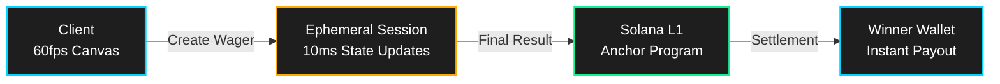

# MagicBlock Architecture Diagram



## Visual Description for Static Image

**For video, create simple diagram showing:**

```
┌─────────────────┐
│   CLIENT        │  60fps gameplay
│   React Canvas  │  Zero latency
└────────┬────────┘
         │
         ▼
┌─────────────────┐
│  EPHEMERAL      │  10ms state updates
│  ROLLUP (ER)    │  MagicBlock
└────────┬────────┘
         │
         ▼
┌─────────────────┐
│  SOLANA L1      │  Final settlement
│  Anchor Program │  Trustless escrow
└────────┬────────┘
         │
         ▼
┌─────────────────┐
│  WINNER WALLET  │  Instant payout
│  0.2 SOL        │
└─────────────────┘
```

**Color Scheme:**
- Client: Cyan (#00d4ff)
- ER: Gold (#ffaa00)
- L1: Green (#14f195)
- Wallet: Cyan (#00d4ff)

**Text Overlays:**
- Phase 1: "Solana L1 (400ms)" → Current
- Phase 2: "MagicBlock ER (10ms)" → Roadmap
